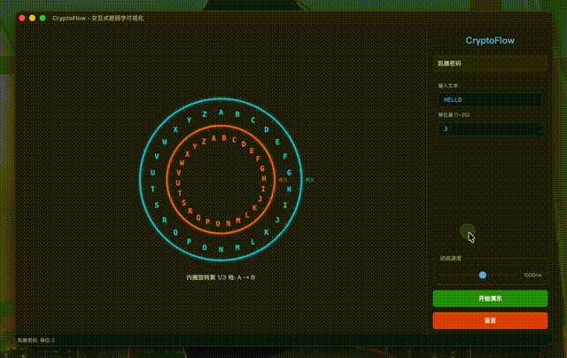
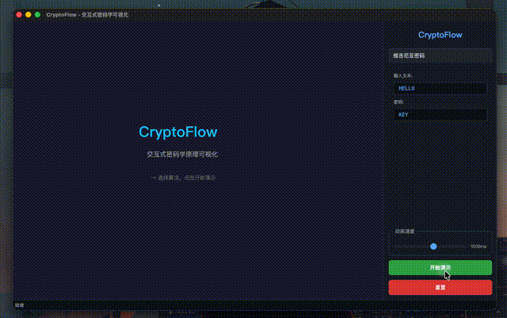
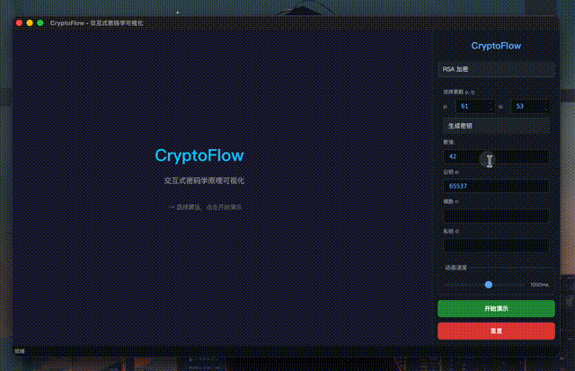
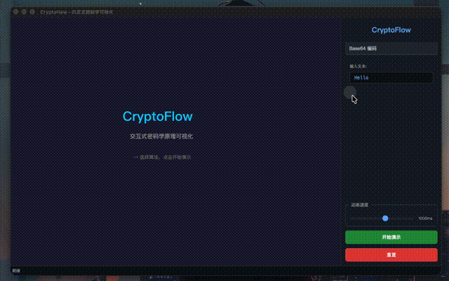
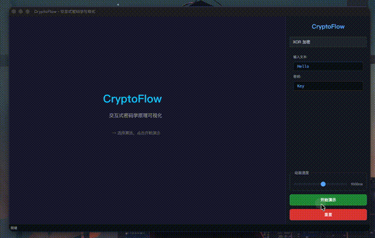

# CryptoFlow

交互式密码学原理可视化演示系统 — 南开大学高级语言程序设计课程大作业

## 功能特性

5 种经典密码算法的交互式可视化演示：

| 算法 | 可视化方式 | 说明 |
|------|-----------|------|
| **凯撒密码** | 双圈转盘动画 | 外圈固定明文，内圈逆时针旋转对齐密文，逐字母高亮 + 脉冲发光 |
| **维吉尼亚密码** | 双圈转盘 + 关键词 | 根据关键词逐字母切换偏移量，黄色关键词高亮显示 |
| **RSA** | 7 步密钥生成流程 | 居中卡片布局，圆形步骤编号，绿色高亮数值，加密/解密双向演示 |
| **Base64 编码** | 5 步卡片流程 | 明文 → 二进制 → 6bit 分组 → 查表 → 结果，数据流动画 |
| **XOR 加密** | 4 步卡片流程 | 明文 ↔ 密钥逐字节 XOR，实时二进制可视化 |

### 交互功能

- 右侧控制面板：选择算法、调整参数、控制动画速度（200ms - 2000ms）
- 支持手动输入明文、密钥、位移量等参数
- 自动演示模式（CLI 参数直接启动）

## 演示

### 凯撒密码



### 维吉尼亚密码



### RSA



### Base64 编码



### XOR 加密



## 技术栈

- **语言**: C++20
- **GUI 框架**: Qt 6 (Widgets)
- **构建系统**: CMake 3.20+
- **动画引擎**: QTimer + QEasingCurve (QGraphicsView/QGraphicsScene)
- **主题**: QSS 深色科技风格（#0d1117 背景，霓虹蓝/绿高亮）

## 构建与运行

### 前置依赖

- CMake 3.20+
- Qt 6（Widgets 模块）
- 支持 C++20 的编译器（GCC 10+ / Clang 13+ / MSVC 2019+）

### macOS (Homebrew)

```bash
brew install qt@6
cmake -B build -DCMAKE_PREFIX_PATH=/opt/homebrew/opt/qt@6
cmake --build build
./build/CryptoFlow
```

### Linux (Ubuntu/Debian)

```bash
sudo apt install qt6-base-dev libgl1-mesa-dev
cmake -B build
cmake --build build
./build/CryptoFlow
```

### Windows (MSVC)

```powershell
# 安装 Qt 6 后
cmake -B build -DCMAKE_PREFIX_PATH="C:/Qt/6.x.x/msvc2019_64"
cmake --build build --config Release
./build/Release/CryptoFlow.exe
```

### CLI 自动演示

```bash
./build/CryptoFlow --caesar "HELLO" --shift 3    # 凯撒密码演示
./build/CryptoFlow --rsa                           # RSA 密钥生成演示
./build/CryptoFlow --base64 "Hello"                # Base64 编码演示
./build/CryptoFlow --xor "HELLO" --xor-key "KEY"  # XOR 加密演示
```

## 项目结构

```
src/
├── main.cpp              # 入口 + CLI 参数解析
├── mainwindow.h/cpp      # 主窗口：QSplitter 左(场景)右(面板)布局
├── controlpanel.h/cpp    # 右侧控制面板：算法选择、参数输入、速度控制
├── crypto/
│   ├── caesar.h/cpp      # 凯撒密码算法层
│   ├── rsa.h/cpp         # RSA 算法层（密钥生成、加解密、模幂运算）
│   └── vigenere.h/cpp    # 维吉尼亚密码算法层
└── scenes/
    ├── caesarscene.h/cpp  # 凯撒转盘动画场景
    ├── rsascene.h/cpp     # RSA 密钥生成动画场景
    ├── vigenerecene.h/cpp # 维吉尼亚转盘动画场景
    ├── base64scene.h/cpp  # Base64 编码可视化场景
    └── xorscene.h/cpp     # XOR 加密可视化场景
resources/
├── resources.qrc         # Qt 资源文件
└── style.qss             # 深色科技主题样式
display/                  # 视频制作
├── script.md             # 视频脚本（时间轴、字幕、操作说明）
├── subtitles.srt         # 字幕文件
├── record.sh             # 录制所有片段
├── compose.sh            # 合成最终视频
├── fragments/            # 录制的视频片段
└── output/               # 最终输出
reports/                  # 实验报告（LaTeX）
├── report.tex            # 报告源文件
├── Makefile              # 编译脚本
└── 2512039_程至研.pdf     # 生成的 PDF
```

## 架构设计

- **算法层 (crypto/)**: 纯计算逻辑，与 UI 解耦
- **场景层 (scenes/)**: QGraphicsScene 子类，负责动画和可视化
- **控制面板**: QStackedWidget 动态切换 5 种算法控件
- **动画系统**: 离散步进 + QEasingCurve 缓动，animationId_ 防并发冲突
- **日志系统**: 自定义 messageHandler 双输出（stderr + cryptoflow.log）

## 开发工具

- Claude (Anthropic) — 代码开发辅助

## License

MIT
